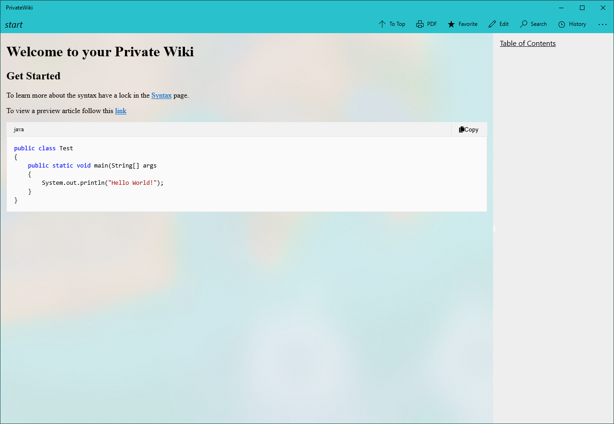
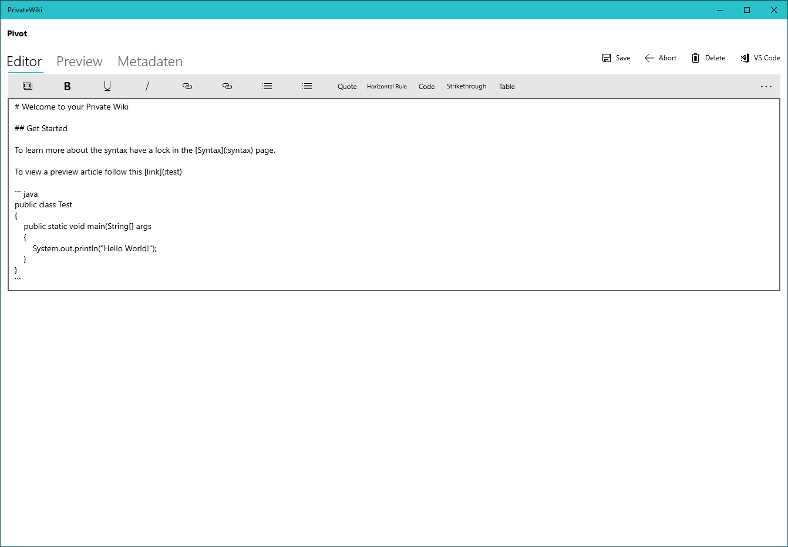

# PrivateWiki

A private wiki built on UWP and with markdown as wiki language.

## Features

- Page viewing and editing
- Page History
- Search: ugly but working; only searches for the page link not content
- Customizable rendering pipeline
- Export to markdown and html

## Screenshots

The Page Viewer:

And the Editor:

And the Settings Page:

